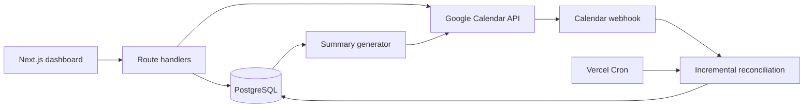

# Snapshot

Snapshot turns Google Calendar events into an organized task dashboard and keeps useful daily and weekly summaries in the calendar itself. An event such as `Assignment 3 [CS 2214]` becomes a task under **CS 2214**; adding `!` to the front marks it complete.

The project combines a Next.js interface with a server-side synchronization pipeline built around Google Calendar push notifications, incremental sync tokens, and PostgreSQL persistence.

## Highlights

- **Calendar-first task management:** Create or edit tasks in Google Calendar or from the dashboard. Snapshot links records by Google event ID, so later changes update the same task instead of creating duplicates.
- **Automatic organization:** Course names are parsed from event titles, matched case-insensitively, and created as needed.
- **Daily summaries:** Idempotent `Today` and `Tomorrow` events group upcoming work by course and include selected completed tasks.
- **Weekly planning:** Nine-day summaries cover Saturday through the following Sunday. Snapshot maintains upcoming weeks and supports additional requested weeks.
- **Reliable synchronization:** Google push notifications trigger incremental updates. A daily Vercel Cron job reconciles missed notifications and renews expiring watch channels. Expired sync tokens automatically fall back to a full sync.
- **Timezone-aware output:** Calendar dates and summary times use the timezone reported by the user's primary Google Calendar.
- **Configurable presentation:** Users can adjust summary times, duration, lookahead, minimum tasks per course, and course ordering.

## Architecture



The dashboard reads persisted tasks from PostgreSQL. Calendar changes reach the webhook as lightweight notifications; the server then requests only changes since the saved sync token, applies them transactionally, and regenerates affected summaries. Stable private markers let Snapshot update generated events instead of duplicating them.

## Technology

- Next.js 16 App Router, React 19, and TypeScript
- PostgreSQL with parameterized queries and transaction helpers
- Google OAuth 2.0 and Google Calendar API
- Google Calendar push notifications and incremental synchronization
- Vercel serverless functions and scheduled Cron
- Node's test runner and ESLint

## Local Development

### Prerequisites

- Node.js 20.9 or newer
- PostgreSQL
- A Google Cloud project with the Google Calendar API enabled

### Setup

1. Install dependencies:

  ```bash
  npm install
  ```

2. Create a PostgreSQL database and apply [db/schema.sql](db/schema.sql).

3. Copy `.env.example` to `.env.local` and configure:

  | Variable | Purpose |
  | --- | --- |
  | `STORAGE_DATABASE_URL` | PostgreSQL connection string |
  | `GOOGLE_CLIENT_ID` | Google OAuth client ID |
  | `GOOGLE_CLIENT_SECRET` | Google OAuth client secret |
  | `GOOGLE_REDIRECT_URI` | OAuth callback, normally `http://localhost:3000/api/auth/google/callback` locally |
  | `SESSION_SECRET` | Secret used to sign session cookies |
  | `CRON_SECRET` | Bearer token for the reconciliation endpoint |
  | `APP_URL` | Public application URL used for Calendar webhooks |

4. Add `GOOGLE_REDIRECT_URI` to the OAuth client's authorized redirect URIs in Google Cloud.

5. Start the app and open `http://localhost:3000`:

  ```bash
  npm run dev
  ```

Google Calendar push notifications require a public HTTPS `APP_URL`. Local task and UI development works without one, but webhook delivery requires a tunnel or deployed environment.

## Event Format

Snapshot tracks events whose titles end with a course in square brackets:

```text
Assignment 3 [CS 2214]
!Exam [CS 1100]
```

The event start is the task due date. A leading `!` marks the task complete and is omitted from its displayed name. Removing the course suffix or deleting the event removes the corresponding tracked task during synchronization.

## Commands

```bash
npm run dev    # Start the development server
npm test       # Run domain behavior tests
npm run lint   # Run ESLint
npm run build  # Create a production build
```

## Deployment

Deploy the repository root to Vercel, configure the environment variables above, and set the production OAuth redirect URI in Google Cloud. [vercel.json](vercel.json) invokes the protected reconciliation endpoint every day at `08:00 UTC`.

The webhook endpoint is `POST /api/webhooks/google-calendar`. The scheduled fallback is `GET /api/cron/reconcile` with `Authorization: Bearer <CRON_SECRET>`.
